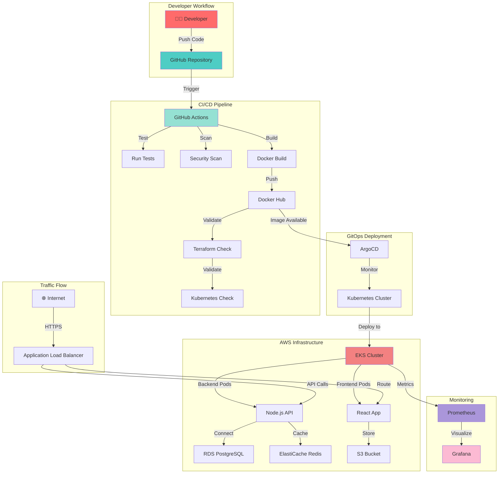

<div align="center">

# 🪔 Durga Puja DevOps Platform


### 🚀 Production-Grade Photo Sharing Platform with Complete DevOps Automation

[](https://github.com/SHUBHADEEPXT/Durga-Puja_Website_Project/stargazers)
[](https://github.com/SHUBHADEEPXT/Durga-Puja_Website_Project/network/members)
[](https://github.com/SHUBHADEEPXT/Durga-Puja_Website_Project/issues)
[](https://github.com/SHUBHADEEPXT/Durga-Puja_Website_Project/blob/main/LICENSE)

[](https://github.com/SHUBHADEEPXT/Durga-Puja_Website_Project/commits/main)
[](https://github.com/SHUBHADEEPXT/Durga-Puja_Website_Project)
[](https://github.com/SHUBHADEEPXT/Durga-Puja_Website_Project)
[](https://visitorbadge.io/status?path=SHUBHADEEPXT%2FDurga-Puja_Website_Project)


[🎯 Overview](#-overview) • [✨ Features](#-features) • [🏗️ Architecture](#️-architecture) • [🚀 Quick Start](#-quick-start) • [📚 Documentation](#-documentation) • [👨‍💻 Author](#-author)

</div>

---

## 🎯 Overview

**Durga Puja DevOps Platform** is a comprehensive, production-ready demonstration of modern DevOps practices, showcasing end-to-end automation from code to deployment. This project implements a full-stack photo-sharing application with complete CI/CD pipelines, infrastructure as code, container orchestration, and observability.

### 🎪 What Makes This Special?
```ascii
┌─────────────────────────────────────────────────────────────────┐
│  🏗️  Infrastructure as Code     |  ⚙️  Complete Automation     │
│  🐳  Containerized Apps         │  📊  Real-time Monitoring    │
│  ☸️  Kubernetes Orchestration   │  🔄  GitOps Workflows        │
│  🔐  Security First Design      │  📈  Auto-scaling Ready      │
└─────────────────────────────────────────────────────────────────┘
```

---
## 💼 Built With Enterprise-Grade Technologies== Tech Stack & Tools

<div align="center">

[]
[] 


 


</div>

---

## ✨ Features

### 🏗️ Infrastructure & Cloud
<table>
<tr>
<td width="50%">

#### ☁️ AWS Cloud Infrastructure

✅ Multi-AZ VPC Design (3 Availability Zones)  
✅ 9 Subnets (Public, Private, Database tiers)  
✅ NAT Gateways for Private Subnet Internet  
✅ Internet Gateway for Public Access  
✅ Security Groups & Network ACLs  
✅ Route Tables with Proper Routing  

</td>
<td width="50%">

#### 🎛️ Managed Services

✅ Amazon EKS (Kubernetes 1.28)  
✅ Amazon RDS (PostgreSQL 15)   
✅ Amazon ElastiCache (Redis 7.0)  
✅ Amazon S3 (Encrypted Storage)  
✅ Application Load Balancer  
✅ Auto Scaling Groups  

</td>
</tr>
</table>

### 🔄 DevOps & Automation
<table>
<tr>
<td width="50%">

#### 🚀 CI/CD Pipeline

✅ Automated Testing (Frontend & Backend)  
✅ Security Scanning (npm audit)  
✅ Docker Image Building  
✅ Multi-stage Builds  
✅ Image Tagging with Git SHA  
✅ Push to Docker Hub  
✅ Infrastructure Validation  

</td>
<td width="50%">

#### 🔄 GitOps Workflow

✅ ArgoCD for Continuous Deployment  
✅ Declarative Configuration  
✅ Automated Sync from Git  
✅ Self-healing Applications  
✅ Rollback Capabilities  
✅ Multi-environment Support  

</td>
</tr>
</table>

### ☸️ Kubernetes & Orchestration
<table>
<tr>
<td width="50%">

#### 📦 Container Orchestration

✅ Deployments with 3 Replicas  
✅ Horizontal Pod Autoscaling (3-10 pods)  
✅ Services (ClusterIP & LoadBalancer)  
✅ Ingress with AWS ALB Controller  
✅ ConfigMaps for Configuration  
✅ Secrets Management  

</td>
<td width="50%">

### 📊 Monitoring & Observability

✅ Prometheus for Metrics Collection  
✅ Grafana Dashboards  
✅ Real-time Cluster Monitoring  
✅ Pod & Node Metrics  
✅ Resource Usage Tracking  
✅ Custom Alerts (Configurable)  

</td>
</tr>
</table>

---
## 🧱 Architecture



---

### 🎯 High-Level Architecture

```
┌──────────────────────────────────────────────────────────────────┐
│                         Internet Users                           │
└────────────────────────┬─────────────────────────────────────────┘
		         │
                         ▼
┌─────────────────────────────────────────────────────────────────┐
│                   AWS Application Load Balancer                 │
│                    (Port 80/443 - SSL Termination)              │
└────────────────────────┬────────────────────────────────────────┘

         ┌───────────────┴───────────────┐
         │                               │
         ▼                               ▼
┌──────────────────┐            ┌──────────────────┐
│  Frontend Pods   │            │  Backend Pods    │
│  (React + Vite)  │◄──────────►│  (Node.js)       │
│  Replicas: 3-10  │            │  Replicas: 3-10  │
└──────────────────┘            └────────┬─────────┘
					                               │					  
                    ┌────────────────────┼────────────────────┐
                    │                    │                    │
                    ▼                    ▼                    ▼
         ┌──────────────────┐  ┌──────────────────┐  ┌─────────────┐
         │   RDS Postgres   │  │ ElastiCache Redis│  │  S3 Bucket  │
         │   (Database)     │  │    (Cache)       │  │  (Storage)  │
         └──────────────────┘  └──────────────────┘  └─────────────┘
```
---

## Architecture Diagrams

### AWS Infrastructure


### CI/CD Pipeline  


### Kubernetes Cluster


### Data Flow


### Monitoring Stack


---

### 🔐 Network Architecture

```
VPC: 10.0.0.0/16
│
├─ AZ 1 (us-east-1a)
│  ├─ Public Subnet: 10.0.1.0/24    → NAT Gateway, ALB
│  ├─ Private Subnet: 10.0.11.0/24  → EKS Worker Nodes
│  └─ Database Subnet: 10.0.21.0/24 → RDS, ElastiCache
│
├─ AZ 2 (us-east-1b)
│  ├─ Public Subnet: 10.0.2.0/24
│  ├─ Private Subnet: 10.0.12.0/24
│  └─ Database Subnet: 10.0.22.0/24
│
└─ AZ 3 (us-east-1c)
├─ Public Subnet: 10.0.3.0/24
├─ Private Subnet: 10.0.13.0/24
└─ Database Subnet: 10.0.23.0/24
```

---

## 🚀 Quick Start

### 📋 Prerequisites

<table>
<tr>
<td>

**Required Tools**
- AWS CLI (v2+)
- Terraform (v1.5+)
- kubectl (v1.28+)
- Docker (v20+)
- Helm (v3+)

</td>
<td>

**AWS Requirements**
- AWS Account with Admin Access
- IAM User with Programmatic Access
- AWS CLI Configured
- ~$10-15/day Budget for Demo

</td>
</tr>
</table>

### 🔧 Installation

#### 1️⃣ Clone the Repository
```bash
git clone https://github.com/SHUBHADEEPXT/Durga-Puja_Website_Project.git
cd Durga-Puja_Website_Project
```


#### 2️⃣ Configure AWS Credentials
```aws configure```
- AWS Access Key ID: YOUR_ACCESS_KEY
- AWS Secret Access Key: YOUR_SECRET_KEY
- Default region: us-east-1
- Default output format: json


#### 3️⃣ Set Up GitHub Secrets

Add these secrets to your GitHub repository:  
- DOCKER_USERNAME         # Your Docker Hub username  
- DOCKER_PASSWORD         # Your Docker Hub password  
- AWS_ACCESS_KEY_ID       # AWS Access Key  
- AWS_SECRET_ACCESS_KEY   # AWS Secret Key  
- MONGODB_PASSWORD        # Database password  
- REDIS_PASSWORD          # Redis password  
- VITE_API_URL           # Frontend API URL  


#### 4️⃣ Deploy Infrastructure
```
cd infrastructure/terraform
```
- Initialize Terraform  
``` 
terraform init
```

- Review the plan  
```
terraform plan 
```

- Deploy (takes ~25 minutes)  
```
terraform apply -auto-approve
```


#### 5️⃣ Configure kubectl

- Update kubeconfig  
```
aws eks update-kubeconfig --region us-east-1 --name durga-puja-eks
```
- Verify connection  
```
kubectl get nodes
```

#### 6️⃣ Deploy Application
```
cd ../kubernetes
```
- Deploy all resources  
```
kubectl apply -f namespaces/
kubectl apply -f configmaps/
kubectl apply -f secrets/
kubectl apply -f deployments/
kubectl apply -f services/
kubectl apply -f ingress/
```
- Wait for pods  
```
kubectl get pods -n durga-puja -w
```


#### 7️⃣ Install Monitoring
- Add Helm repo  
```
helm repo add prometheus-community https://prometheus-community.github.io/helm-charts
helm repo update
```
- Install monitoring stack  
```
helm install monitoring prometheus-community/kube-prometheus-stack \
  --namespace monitoring \
  --create-namespace \
  --set grafana.adminPassword=admin123
```

#### 8️⃣ Install ArgoCD
- Install ArgoCD  
```
kubectl create namespace argocd
kubectl apply -n argocd -f https://raw.githubusercontent.com/argoproj/argo-cd/stable/manifests/install.yaml
```
- Get admin password  
```
kubectl -n argocd get secret argocd-initial-admin-secret \
  -o jsonpath="{.data.password}" | base64 -d
```


#### 9️⃣ Access Applications
- Get Application URL  
```
kubectl get ingress -n durga-puja
```

- Port-forward Grafana  
```
kubectl port-forward -n monitoring svc/monitoring-grafana 3000:80
```

- Port-forward ArgoCD  
```
kubectl port-forward -n argocd svc/argocd-server 8080:443
```

---

## 📚 Documentation

| 📘 **Document**                                         | 🧾 **Description**                         |
| ------------------------------------------------------- | ------------------------------------------ |
| [**Architecture Guide**](docs/architecture/README.md)   | Detailed architecture and design decisions |
| [**Deployment Guide**](docs/deployment/README.md)       | Step-by-step deployment instructions       |
| [**Configuration Guide**](docs/configuration/README.md) | Configuration options and customization    |
| [**Monitoring Guide**](docs/monitoring/README.md)       | Setting up and using monitoring tools      |
| [**Security Guide**](docs/security/README.md)           | Security best practices and hardening      |
| [**Troubleshooting**](docs/troubleshooting/README.md)   | Common issues and their solutions          |
| [**Cost Analysis**](docs/cost-analysis/README.md)       | AWS cost breakdown and optimization        |


---

##🎓 What I Learned
<table>
<tr>
<td width="33%">
#### ☁️ Cloud & Infrastructure

- AWS VPC design patterns  
- Multi-AZ high availability  
- Security group configuration  
- IAM roles and policies  
- Cost optimization strategies  

</td>
<td width="33%">
#### 🔄 DevOps & Automation

- CI/CD pipeline design  
- GitOps workflows  
- Container orchestration  
- Infrastructure as Code  
- Automated testing strategies  

</td>
<td width="33%">
#### 📊 Monitoring & Operations

- Metrics collection  
- Dashboard creation  
- Alert configuration  
- Log aggregation  
- Performance tuning  

</td>
</tr>
</table>

---

##🛣️ Roadmap

- Complete AWS infrastructure with Terraform  
- Kubernetes cluster setup and configuration  
- CI/CD pipeline with GitHub Actions  
- Docker image registry integration  
- GitOps with ArgoCD  
- Monitoring with Prometheus/Grafana  
- Service Mesh (Istio) integration  
- Multi-region deployment  
- Advanced security scanning  
- Automated backup and DR  
- Canary deployments  
- Integration testing automation  

---

## 🤝 Contributing

- Contributions, issues, and feature requests are welcome but from Early December 2025!  

- Fork the Project  
- Create your Feature Branch (git checkout -b feature/AmazingFeature)  
- Commit your Changes (git commit -m 'Add some AmazingFeature')  
- Push to the Branch (git push origin feature/AmazingFeature)  
- Open a Pull Request  

**See CONTRIBUTING.md for detailed guidelines.**  


---

## 📄 License
- This project is licensed under the MIT License - see the LICENSE file for details.

---

## 👨‍💻 Author
<div align="center">
Shubhadeep

- 🌐 Connect With Me

[](https://github.com/SHUBHADEEPXT)  
[](https://www.linkedin.com/in/shubhadeep-bhowmik-74b5a214b/)  
[](mailto:shubhadeep010@gmail.com)  

</div>

---

## 🙏 Acknowledgments

- Terraform AWS Modules
- Kubernetes Documentation
- ArgoCD Documentation
- Prometheus Community
- Grafana Labs

---

## 📞 Support
- If you find this project helpful, please consider giving it a ⭐️!
- For questions or support:  

- 📧 Email: shubhadeep010@gmail.com
- 💬 Open an Issue
- 📖 Check the Documentation

---

- 💫 Show Your Support  
- If this project helped you learn something new, please give it a ⭐️!  

<div align="center">
Made with ❤️❤️❤️ by Shubhadeep  
</div>


```
⭐️ Star this repository if you found it helpful!
🍴 Fork it to create your own version!
📫 Connect with me on LinkedIn!
```

---

## 📊 GithuB Statistics

<div align="center">


</div>
